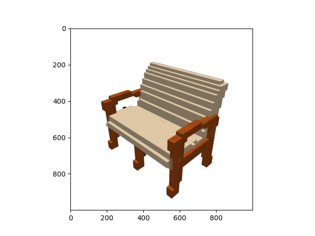

<h1 align="center">Text2Shape</h1>

<div align="center">
  <strong>Generating Shapes from Natural Language by Learning Joint Embeddings</strong>
</div>
<div align="center">
  <code>Implementation of Paper and Improvements</code>
</div>


## Example for text to shape generation
```
"this antique look table appear to be green and gray marble . the heavy thick - sided top be square and show geometric detail in green , on a gray background , while the carved support column , locate UNK center of the table , reflect the geometric motif and feature a double - square base"
```


## Example for shape to text generation

```
"a brown color wooden frame double seater sofa chair with creme color cushion and backrest . it also have wooden armrest ."
```


## TSNE plots show that shape and colors share similarities in embedding space


### Dataset
- [x] [Dataset](http://text2shape.stanford.edu/](http://text2shape.stanford.edu/)
